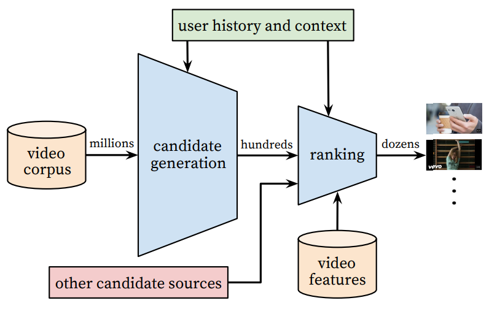

# Youtube Recommendation Tensorflow-Keras

#### Movie recommendation system using YouTube recommendation system.   
#### 유튜브 추천 시스템을 사용한 영화 추천 시스템.
   
Simple tf-keras code of paper [\[Deep Neural Networks for YouTube Recommendations\]](https://static.googleusercontent.com/media/research.google.com/ko//pubs/archive/45530.pdf).  
Jupiter notebook files `recommendation.ipynb` with detailed description.
   
유튜브 추천 시스템을 논문과 여러 자료를 참고하여 텐서플로 케라스로 구현하였습니다.   
주피터 노트북 파일 `recommendation.ipynb` 에 자세한 설명이 포함되어 있습니다.
   
<p align="center">

</p>   
  
This code <em><strong>contains 'candidate generation' only</strong></em>.   
This code does <em><strong>not include 'ranking'</strong></em>.   
   
이 코드는 <em><strong>'candidation generaion'</strong></em> 부분만 포함합니다.   
<em><strong>'ranking'</strong></em> 은 포함하지 않습니다.
   
## How to test code
Check `recommendation.ipynb` file

* Result
```
Movie Recommendation for user 1 (movie_ID): [53, 1064, 1111, 510, 1488, 239, 230, 1157, 281, 162]
```
* Matrix (User 1 MAP)
```
### Model Prediction VS Random Pick ###

top N  = 1 -------------------

model  = Rank 1 Recall    : 0.0072992700729927005 (1/137)
model  = Rank 1 Precision : 1.0 (1/1)

random = Rank 1 Recall    : 0.0 (0/137)
random = Rank 1 Precision : 0.0 (0/1)

top N  = 10 -------------------

model  = Rank 10 Recall    : 0.014598540145985401 (2/137)
model  = Rank 10 Precision : 0.2 (2/10)

random = Rank 10 Recall    : 0.0 (0/137)
random = Rank 10 Precision : 0.0 (0/10)

top N  = 20 -------------------

model  = Rank 20 Recall    : 0.014598540145985401 (2/137)
model  = Rank 20 Precision : 0.1 (2/20)

random = Rank 20 Recall    : 0.0072992700729927005 (1/137)
random = Rank 20 Precision : 0.05 (1/20)

top N  = 30 -------------------

model  = Rank 30 Recall    : 0.029197080291970802 (4/137)
model  = Rank 30 Precision : 0.13333333333333333 (4/30)

random = Rank 30 Recall    : 0.0364963503649635 (5/137)
random = Rank 30 Precision : 0.16666666666666666 (5/30)

top N  = 40 -------------------

model  = Rank 40 Recall    : 0.058394160583941604 (8/137)
model  = Rank 40 Precision : 0.2 (8/40)

random = Rank 40 Recall    : 0.014598540145985401 (2/137)
random = Rank 40 Precision : 0.05 (2/40)

top N  = 50 -------------------

model  = Rank 50 Recall    : 0.06569343065693431 (9/137)
model  = Rank 50 Precision : 0.18 (9/50)

random = Rank 50 Recall    : 0.014598540145985401 (2/137)
random = Rank 50 Precision : 0.04 (2/50)

mAP@50 = 0.19529945953383454
```
   
## Environment
* python
* tensorflow 2
   
## Reference
* paper
  * [Deep Neural Networks for YouTube Recommendations](https://static.googleusercontent.com/media/research.google.com/ko//pubs/archive/45530.pdf)
* site
  * [Model, Metric (당근마켓 추천 시스템)](https://medium.com/daangn/%EB%94%A5%EB%9F%AC%EB%8B%9D-%EA%B0%9C%EC%9D%B8%ED%99%94-%EC%B6%94%EC%B2%9C-1eda682c2e8c)
  * [추천 시스템 알고리즘](https://medium.com/code-states/%EC%B6%94%EC%B2%9C-%EC%8B%9C%EC%8A%A4%ED%85%9C-%EC%95%8C%EA%B3%A0%EB%A6%AC%EC%A6%98-4e5044960bdd)
  * [Negative Sampleing \[1\]](https://ratsgo.github.io/from%20frequency%20to%20semantics/2017/03/30/word2vec/)  [\[2\]](https://ddiri01.tistory.com/310)  [\[3\]](https://www.sallys.space/blog/2018/04/05/negative-sampling/)  [\[4\]](https://wikidocs.net/69141)
  * [Paper Review \[1\]](http://keunwoochoi.blogspot.com/2016/09/deep-neural-networks-for-youtube.html)  [\[2\]](http://yhs968.blogspot.com/2019/09/part-2-deep-neural-networks-for-youtube.html)  [\[3\]](https://www.slideshare.net/keunbongkwak/deep-neural-networks-for-youtube-recommendations) [\[4\]](https://yamalab.tistory.com/124)
* code
  * https://github.com/hyez/Deep-Youtube-Recommendations
* data
  * [MovieLens 100K Dataset](https://www.kaggle.com/datasets/prajitdatta/movielens-100k-dataset)
  * [MovieLens](https://grouplens.org/datasets/movielens/)
